add functionallity ASSAIMENT 2

-- DELETE TEXT

delete_text() removes a specific number of characters from a given position in a line.
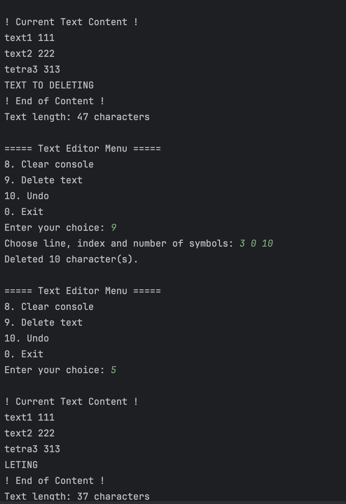

-- UNDO
undo() restores the text to the previous state before the last change.
We implemented this by storing previous versions of textLines. Every change pushes the current state to the undo stack.
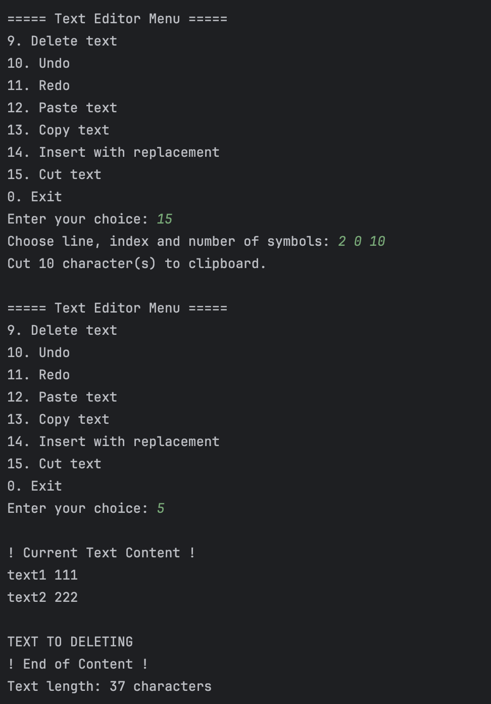
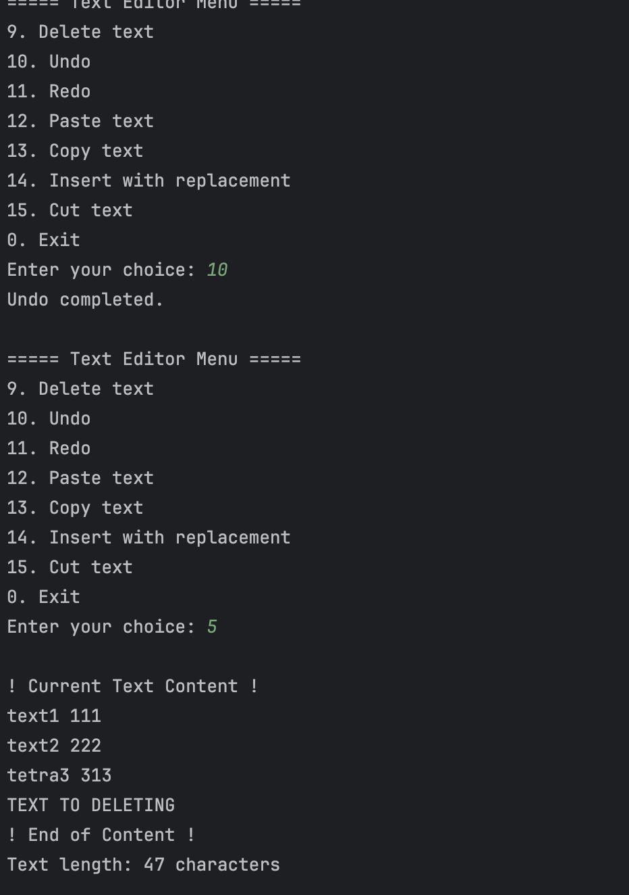
-- REDO
redo() reapplies the last undone change.
We used another stack called redoStack to keep undone states and restore them when redo is called. Redo clears if a new change is made.
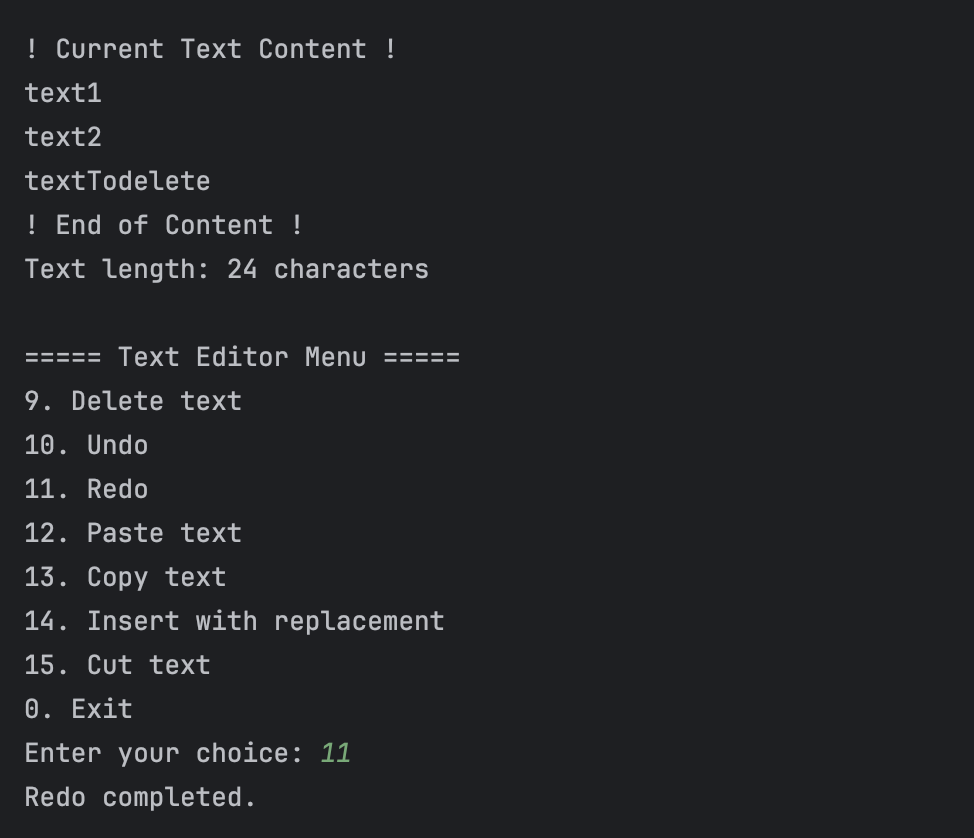
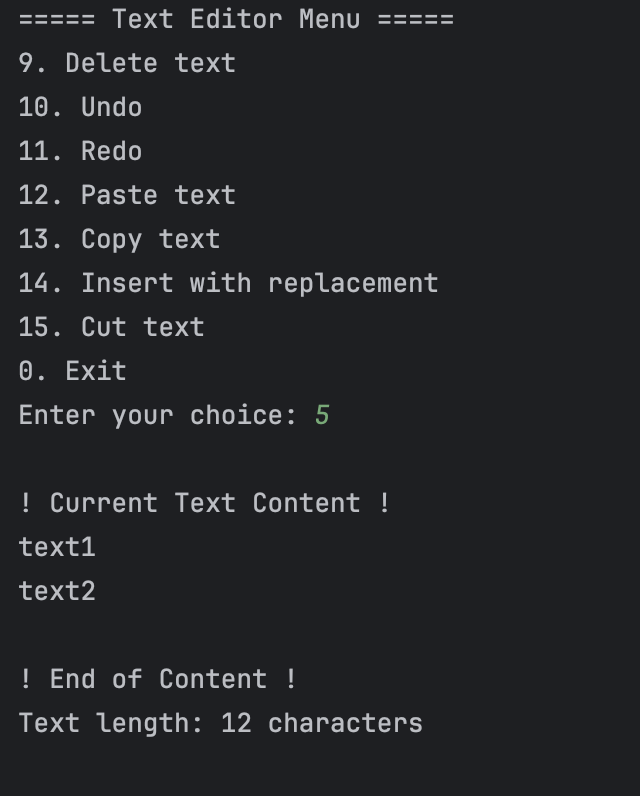
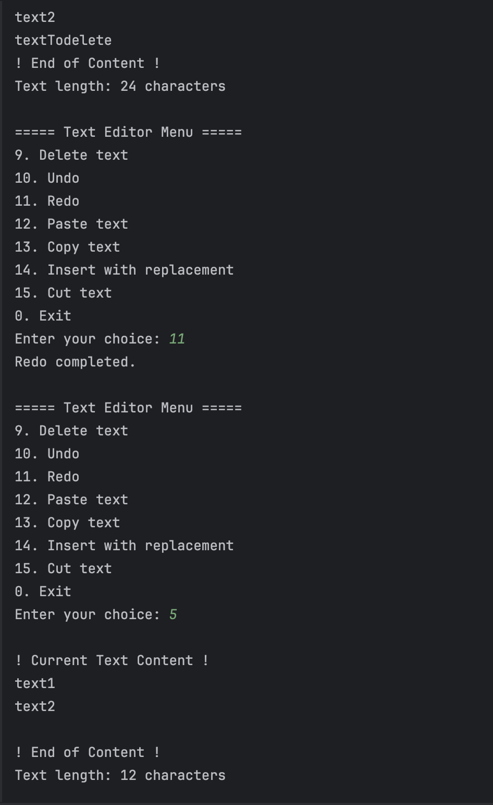
 --Cut
cut() removes text from a line and saves it to a clipboard for later use.
This is implemented as a combination of copy() and delete_text() functions to reuse logic.
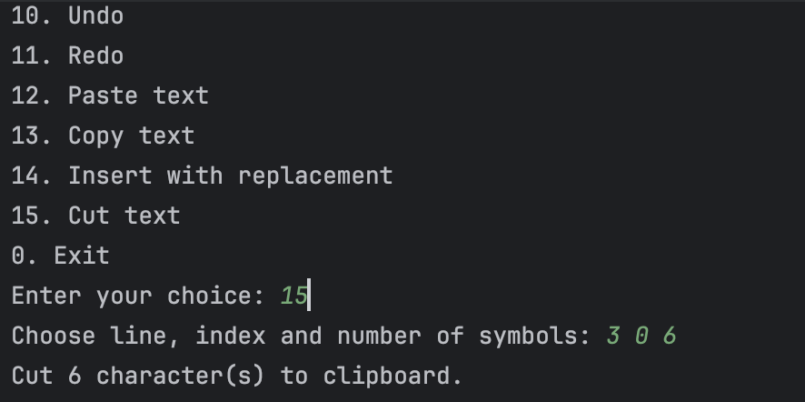
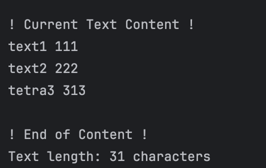

--Copy
copy() saves selected text into a clipboard string without changing the original text.
We used substr() to extract part of a line.
paste() inserts the clipboard contents at a specified position in the text.
We used insert() to add clipboard content into the target line and saved the current state before modifying.
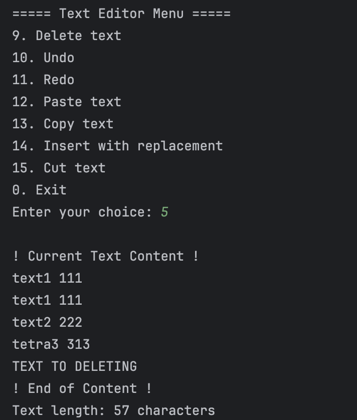
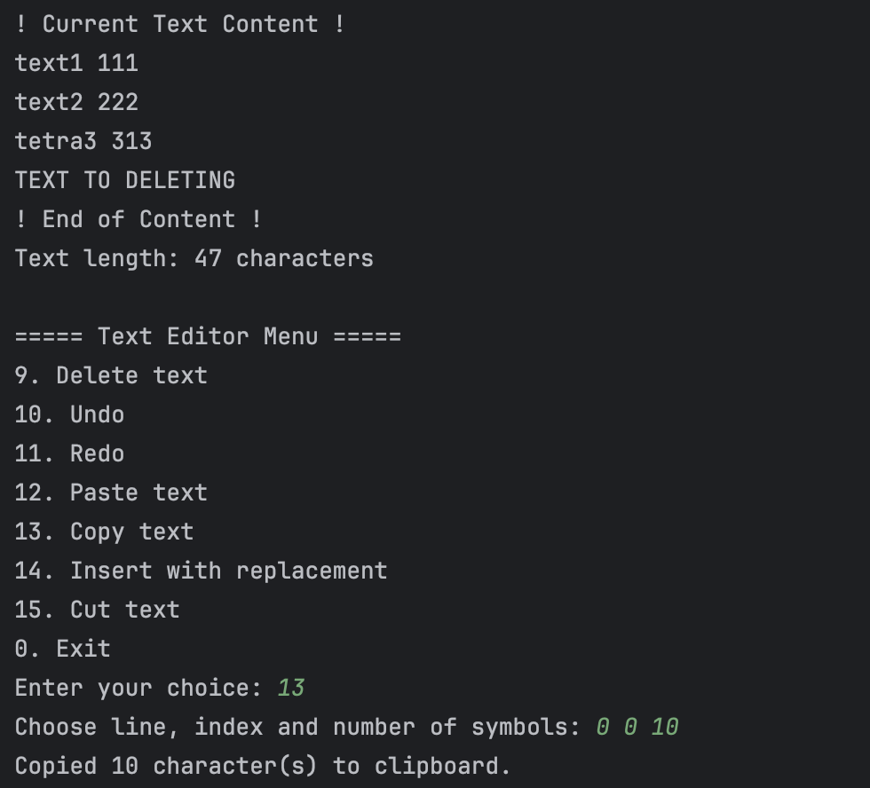

-- Insert command
insert_replacement() adds text at a specific position, potentially pushing existing characters to the right.
Used insert() for simple insertion and saved state before the change for undo/redo support.
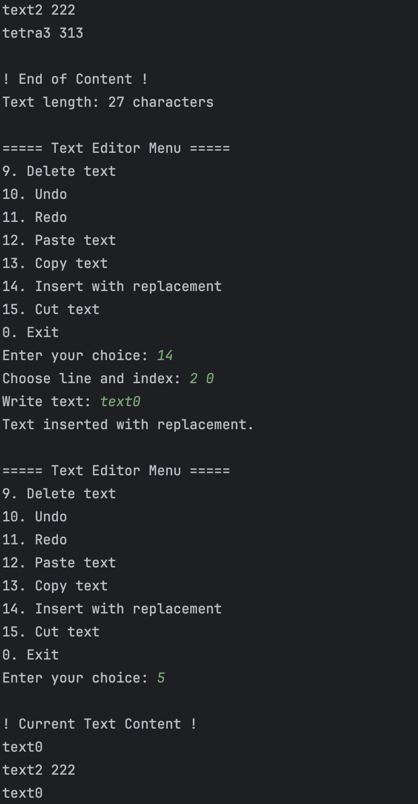

Fields:

std::vector<std::string> textLines; – Stores lines of text.
std::stack<std::vector<std::string>> undoStack; – Saves previous states.
std::stack<std::vector<std::string>> redoStack; – Saves undone states.
std::string clipboard; – Stores copied/cut text.
Methods:

void insert_replacement(int line, int index, const std::string& text);
void delete_text(int line, int index, int count);
void undo();
void redo();
void copy(int line, int index, int count);
void cut(int line, int index, int count);
void paste(int line, int index);
void save_state(); – For undo/redo functionality.

1. What is object-oriented paradigm?
2. What is a class?
3. What is an object?
4. What is the difference between fields and methods?
5. Enumerate key object-oriented principles.
6. Explain benefits of using object-oriented paradigm comparing to procedural and structural.
7. Describe the program translation process from the source code to the final executable.
8. What is compiler responsible for?
9. What is a linker